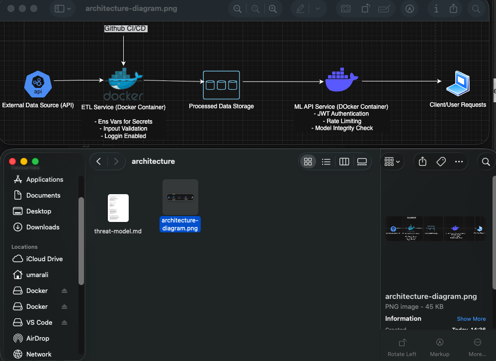
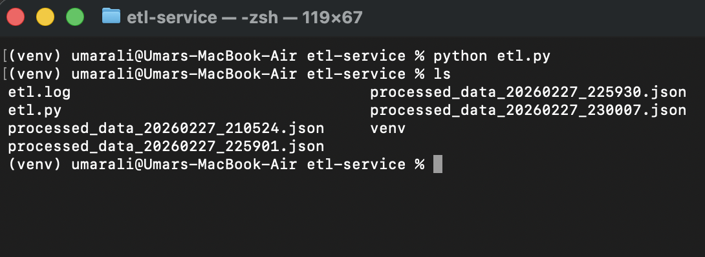
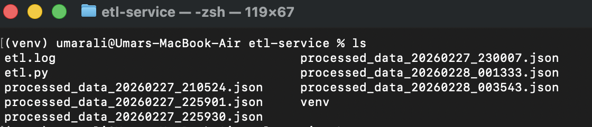
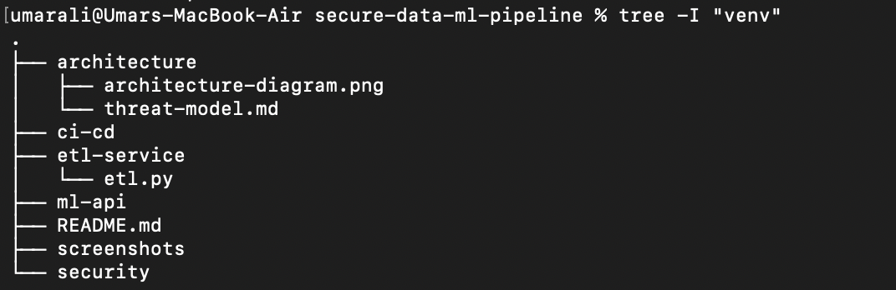

# Secure Data & ML Pipeline

End-to-end secure data ingestion and ML deployment pipeline demonstrating:

- Secure ETL ingestion
- API validation
- Logging and monitoring
- Threat modeling
- DevSecOps practices
- Containerization (coming next)
- CI/CD security scanning (coming next)

---

## 🏗 Architecture

---

## 🔐 Threat Model

See: `architecture/threat-model.md`

This project considers:

- Hardcoded secrets
- API manipulation
- Data poisoning
- Container vulnerabilities
- Supply chain risks
- Unauthorized access

---

## 📦 ETL Service

The ETL service:

- Extracts data from external API
- Validates input structure
- Logs all operations
- Saves processed output safely
- Runs in isolated virtual environment

---

## 📸 Execution Proof

### ETL Execution

### Generated Files

### Project Structure

---

## 🛡 Security Practices Implemented

- Input validation
- Structured logging
- Dependency management
- Virtual environment isolation
- Git hygiene with .gitignore

---

## 🚀 Next Steps

- Dockerize ETL service
- Add container scanning
- Implement CI/CD security pipeline
- Deploy to AWS